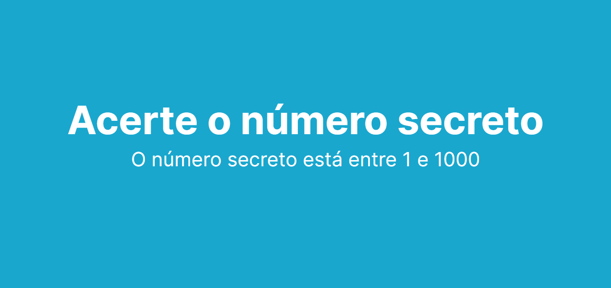
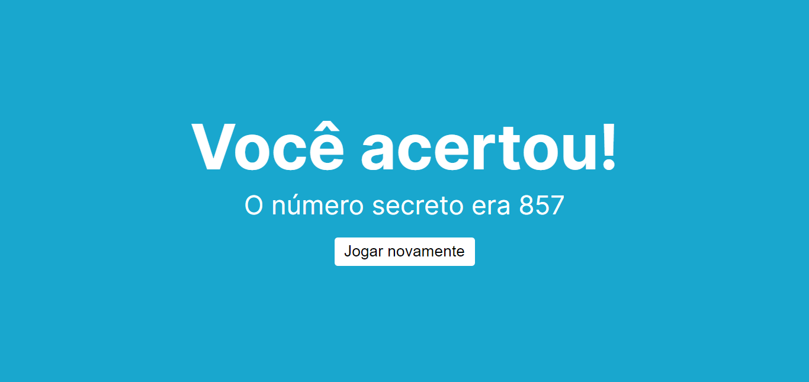
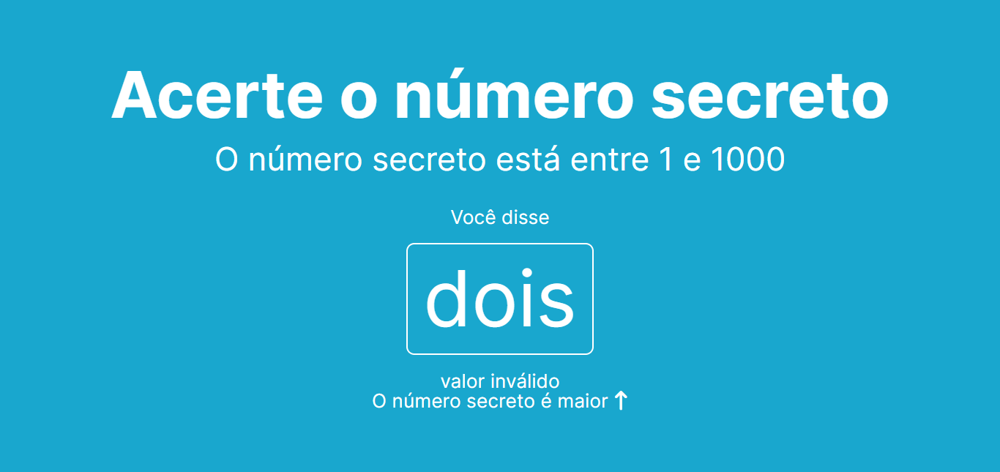

# Reconhecimento de voz com JavaScript

Nesse projeto eu desenvolvi um jogo de adivinhar o número secreto utilizando reconhecimento de voz com JavaScript e a API Web Speech.

<h6 align="center"><a href="https://jean-carlo-torres.github.io/reconhecimento_de_voz_com_js/">**Link para testar o projeto**</a></h6>

<h3>Contribuindo</h3>

⭐️ Star o projeto

🐛 Encontrar e relatar issues
